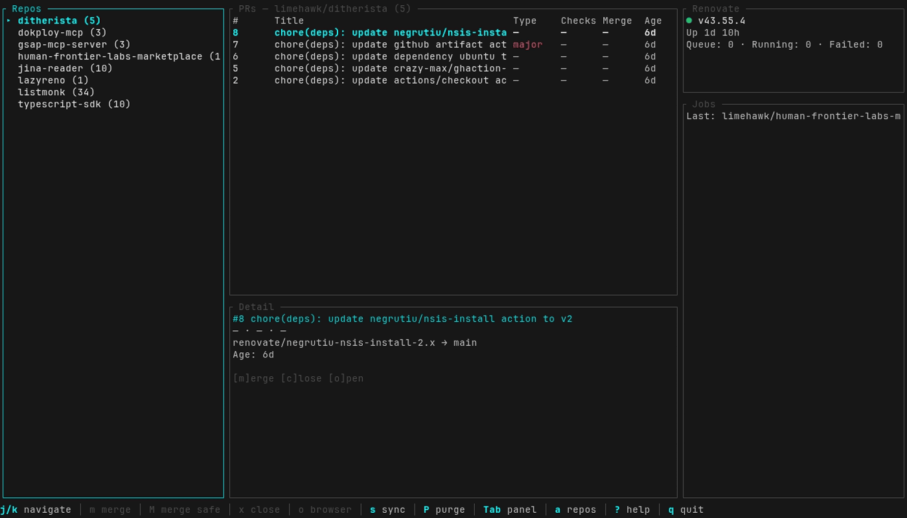

<div align="center">

# lazyreno

A lazy TUI for taming [Renovate CE](https://github.com/mend/renovate-ce-ee) dependency PRs.



[](https://github.com/limehawk/lazyreno/releases)
[](https://aur.archlinux.org/packages/lazyreno)
[](LICENSE)

</div>

---

## Elevator Pitch

Self-hosted Renovate is great until you have 30 repos and wake up to 47 open PRs. You click into GitHub, merge the safe ones, wait for CI, click the next repo, realize half of them need a rebase, go back and comment `/rebase` one by one...

lazyreno puts everything in one keyboard-driven TUI. See every PR across every repo, bulk-merge the safe ones with `M`, rebase the rest with `R`, watch the Renovate job queue drain in real time. No browser tabs. No clicking.

## Features

- **Bento layout** — repo sidebar, PR table + detail, Renovate status + jobs + activity log
- **Bulk merge** — `M` merges all safe PRs (minor/patch, mergeable, checks passing); `A` merges everything
- **Queue-based merging** — handles GitHub's lazy mergeability computation automatically, no repeated retries
- **Renovate commands** — `r` rebase, `e` recreate, `t` retry — posts comments directly to PRs
- **Job monitoring** — live view of running/pending Renovate jobs with queue depth
- **Vim navigation** — `hjkl`, `g`/`G`, `Ctrl+u`/`Ctrl+d`, context-sensitive hints
- **Fuzzy repo filter** — `a` opens a searchable overlay across all repos
- **Fork filtering** — `f` toggles fork visibility (hidden by default)
- **1Password integration** — `op://` secret references resolved automatically via `op` CLI
- **Auto-refresh** — configurable polling interval with real-time activity log

## Built With

| | |
|---|---|
| [Rust](https://www.rust-lang.org/) 2024 edition | Systems language |
| [ratatui](https://ratatui.rs/) | Terminal UI framework |
| [tokio](https://tokio.rs/) | Async runtime |
| [crossterm](https://github.com/crossterm-rs/crossterm) | Terminal manipulation |
| [reqwest](https://github.com/seanmonstar/reqwest) | HTTP client (native-tls) |
| [clap](https://github.com/clap-rs/clap) | CLI argument parsing |
| [chrono](https://github.com/chronotope/chrono) | Date/time handling |
| [tracing](https://github.com/tokio-rs/tracing) | Structured logging |

## Install

### AUR (Arch Linux)

```bash
yay -S lazyreno
```

### From source

```bash
git clone https://github.com/limehawk/lazyreno.git
cd lazyreno
cargo build --release
cp target/release/lazyreno ~/.local/bin/
```

### Releases

Pre-built binaries on the [releases page](https://github.com/limehawk/lazyreno/releases).

## Configuration

Create `~/.config/lazyreno/config.toml`:

```toml
[renovate]
url = "https://your-renovate-instance.example.com"
secret = "your-renovate-api-secret"

[github]
owner = "your-github-org"
token = "your-github-token"

[ui]
refresh_interval = "30s"
accent = "cyan"
```

### 1Password

Secrets can use [1Password secret references](https://developer.1password.com/docs/cli/secret-references/) — resolved automatically:

```toml
[renovate]
secret = "op://Dev/Renovate CE API/credential"

[github]
token = "op://Dev/My GitHub Token/token"
```

### Environment variables

```bash
export LAZYRENO_RENOVATE_SECRET="your-renovate-api-secret"
export LAZYRENO_GITHUB_TOKEN="your-github-token"  # or GITHUB_TOKEN
```

### Renovate CE API setup

Enable the APIs on your Renovate CE instance:

```
MEND_RNV_API_ENABLED=true
MEND_RNV_API_ENABLE_SYSTEM=true
MEND_RNV_API_ENABLE_REPORTING=true
MEND_RNV_API_ENABLE_JOBS=true
RENOVATE_REPOSITORY_CACHE=enabled
```

## Keybindings

### Navigation

| Key | Action |
|---|---|
| `j` / `k` | Move down / up |
| `h` / `l` | Prev / next panel |
| `g` / `G` | Jump to top / bottom |
| `Ctrl+u` / `Ctrl+d` | Half page up / down |
| `Tab` / `Shift+Tab` | Cycle panel focus |
| `Enter` | Focus PR table from sidebar |

### Actions

| Key | Scope | Action |
|---|---|---|
| `m` | PR table | Merge selected PR |
| `M` | PR table | Merge all safe PRs in repo |
| `A` | PR table / sidebar | Merge all PRs in repo |
| `x` | PR table | Close PR + delete branch |
| `r` | PR table | Rebase PR (`/rebase` comment) |
| `R` | PR table / sidebar | Rebase all PRs in repo |
| `e` | PR table | Recreate PR (`/recreate` comment) |
| `t` | PR table | Retry PR (`/retry` comment) |
| `o` | PR table | Open PR in browser |
| `s` | global | Trigger Renovate sync |
| `P` | global | Purge finished jobs |

### General

| Key | Action |
|---|---|
| `a` | All repos overlay (type to filter) |
| `f` | Toggle fork visibility |
| `?` | Help |
| `q` | Quit |

## License

[MIT](LICENSE)
